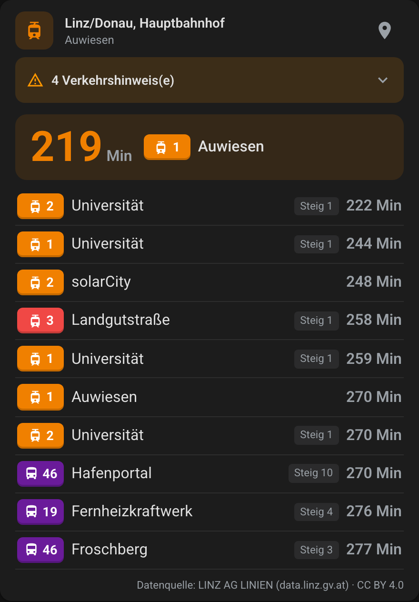
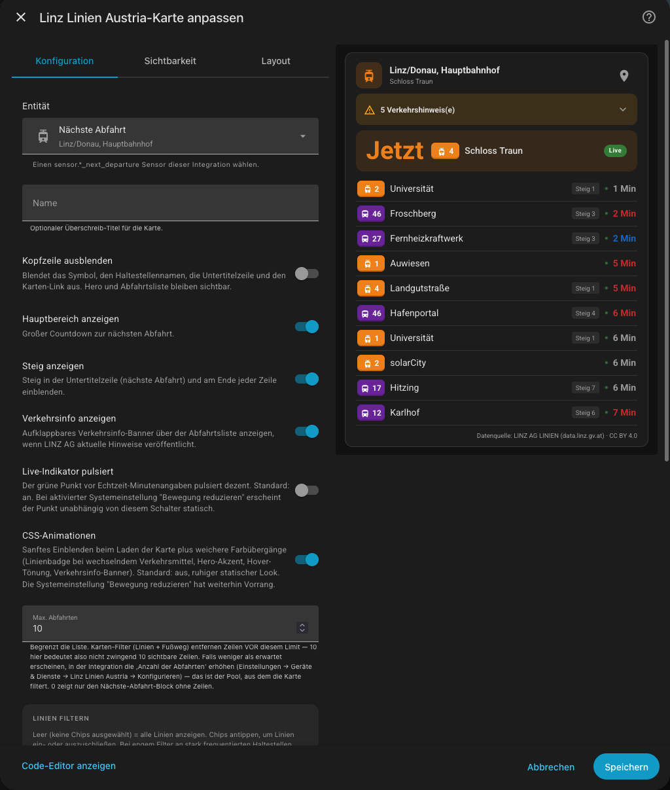
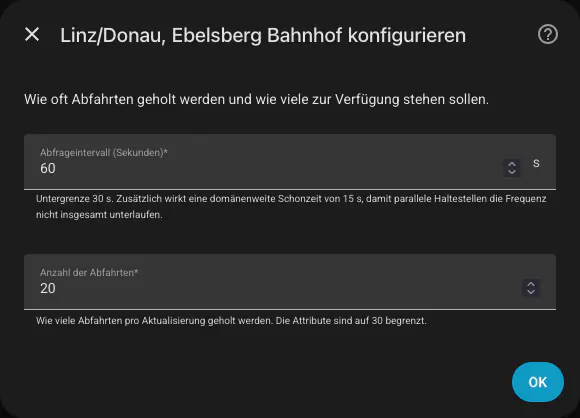

# Linz Linien Austria

[](https://github.com/hacs/integration)
[](https://www.home-assistant.io/)
[](https://github.com/rolandzeiner/linz-linien-austria/releases)
[](https://opensource.org/licenses/MIT)
[](https://en.wikipedia.org/wiki/Vibe_coding)
[](https://demo.rolandzeiner.at/#linz)

Live LINZ AG LINIEN departure monitor for Home Assistant — with a
matching Lit 3 Lovelace card. Polls the same EFA (Elektronische
Fahrplanauskunft) endpoint the official LinzMobil app uses, including
realtime delays and trip cancellations where the upstream provides
them.

## Screenshots

<table>
  <tr>
    <td align="center"></td>
    <td align="center"></td>
    <td align="center"></td>
  </tr>
  <tr>
    <td align="center"><em>Lovelace card</em></td>
    <td align="center"><em>Card editor</em></td>
    <td align="center"><em>Config flow</em></td>
  </tr>
</table>

## Features

### Integration

- **One config entry per stop.** Search-by-name flow — no hunting for
  stop IDs.
- **Realtime-aware countdown sensor** (`SensorDeviceClass.DURATION`,
  unit minutes). The full upcoming departure list, sorted by realtime
  arrival time, lives on `extra_state_attributes` for templates and
  the bundled card.
- **Trip cancellations.** `realtimeTripStatus == TRIP_CANCELLED` is
  surfaced as `departures[].is_cancelled`; cancelled rows render
  visually as "Entfällt" with strikethrough on both card and rows.
- **Service-disruption alerts** (XML_ADDINFO_REQUEST). Fetched once on
  a 5-minute domain-wide cadence and sliced per stop. Each entry's
  sensor exposes alerts via the `alerts` attribute; the card renders
  them as a collapsible banner with high-priority items pinned to the
  top.
- **Robust by design.** Typed coordinator + runtime_data,
  reconfigure flow, repair issues on rate-limit, full translations
  (de + en), diagnostics with defensive redaction.
- **Conservative polling.** 60 s default, 30 s per-entry floor, lock-
  serialised 15 s domain-wide cooldown across every entry + the
  alerts feed. Exponential backoff on consecutive failures (caps at
  30 min) so a sustained outage settles into a slow poll instead of
  hammering the upstream. Request-refresh storms (options-flow save,
  manual reload, dashboard edit-mode flip) are absorbed by a 15 s
  debouncer so the EFA endpoint never sees a burst of redundant
  requests.
- **No long-term statistics noise.** The countdown sensor now omits
  `state_class`, so HA stops generating long-term statistics on a
  value that has no meaningful long-term aggregate (the next-
  departure ETA isn't a measurement worth charting).
- **gzip-compressed responses.** Every outbound call sends
  `Accept-Encoding: gzip`; the EFAController honours it (~7× saving
  on departure responses, similar on the alerts feed).
- **`lines_at_stop` attribute.** Every line the current timetable runs
  through the stop — including rush-hour, seasonal and nightline routes
  with nothing departing right now — exposed for templates and the
  bundled card. Read from the upstream's own line roster, so it is
  complete from the first refresh and correct immediately after a
  reconfigure. *(0.6.0, rebuilt in 0.7.0)*
- **Stop coordinates.** The sensor carries the stop's `latitude` and
  `longitude`, so the card's map link opens the actual bay instead of
  guessing from the stop name, and templates can compute distances.
  *(0.7.0)*
- **Live delay reasons.** When the operator publishes why a trip is
  running late ("Behinderung! Verspätung! Bitte Geduld!"), it appears on
  the departure as `delay_hint` and reads as a caption on the card.
  *(0.7.0)*
- **Named bays and operator.** Each departure carries `stop_bay`
  (`Hauptbahnhof (Busterminal)` vs `(Kärntnerstraße)` vs
  `(Tiefgeschoß)`) and `operator`. At a sprawling stop the bay name says
  more than the platform digit — and it's the only location cue on the
  lines where the upstream reports no platform at all. *(0.7.0)*
- **Onward stops, opt-in.** Turn on *Show onward stops* and every
  departure carries the rest of its trip — each remaining stop with a
  live predicted arrival and the delay carried to it, so you can see
  whether a late tram is expected to recover before your stop. Off by
  default: it roughly triples the data fetched per refresh, so while it
  is on the departure list is shortened to 10. *(0.7.0)*
- **Stable line filter.** The optional line filter keys on the
  upstream's direction code rather than the destination text. Lines with
  a branching terminus publish a different destination per vehicle, so
  the old text keys could drop a line from the filter at random.
  Existing filters are migrated automatically. *(0.7.0)*

### Bundled Lovelace card (`linz-linien-austria-card`)

- **Hero block** — large countdown for the next non-cancelled
  departure, MoT-tinted (orange tram, blue U-Bahn, plum bus, grey
  train) with a Live pill and optional Steig (platform) marker on
  one row. Skips cancelled trips when picking the hero so the big
  number always reads as a real ETA.
- **Realtime cue** — small green bullet leading the time on rows
  where realtime data was available (WCAG 1.4.1: redundant cue for
  colour-blind / sunlight-glare users).
- **Onward-stop trail** — when *Show onward stops* is on, each row gets a
  chevron that unfolds the rest of the trip as a route-line diagram: a
  vertical line in the line's own colour, a dot per remaining stop, and
  a hollow ring on the terminus. Each stop carries its predicted
  arrival, tinted when late, so a delay that recovers further down the
  route is visible at a glance. *(0.7.0)*
- **Delay reason caption** — when the operator says why a trip is late,
  the reason appears under the destination on the row and under the
  hero's line badge, in the same warning colour as a late time. Hidden
  on cancelled trips, where "Entfällt" already tells the whole story.
  *(0.7.0)*
- **Trip cancellations** — strikethrough line + direction, "Entfällt"
  label, no platform shown.
- **Line badge** — fixed-width pill, MoT-tinted, with mode icon
  (`mdi:tram`, `mdi:bus`, `mdi:subway-variant`, `mdi:train`).
- **Header** — icon-tile + stop name + direction subtitle. Tile icon
  and accent recolour to match the next departing line's MoT. Maps
  icon-link on the right opens Google Maps for the stop.
- **Service-disruption banner** — collapsible `<details>` with chevron
  affordance. Pre-filtered to alerts whose `affected_lines` overlap a
  line currently visible in the card (post-card-filter). Toggle on/off
  via *Show traffic info* in the editor.
- **Card-side line filter** — chip widget with MDI-iconed chips
  (mode-of-transport icon + line number, MoT-coloured). Click to
  toggle. The picker shows every line ever seen at this stop (not
  just currently-departing), so nightline / rush-hour / seasonal
  routes stay visible even outside their live service window
  *(0.6.0)*. Custom-value text input is still available for lines
  the picker hasn't observed yet.
- **Per-line walk time (Fußweg)** — drop departures that you couldn't
  catch given your walk to the stop. Per-line minutes input in the
  editor; each line's walk time is independent.
- **Per-line colour override** — pill-style colour picker per line in
  the editor; the chosen colour replaces the MoT default on the
  badge, in the hero accent, and in the header tile when that line
  is the next departure.
- **Optional Steig display** — toggle in the editor; appears in the
  hero subtitle and at the right edge of each row when the upstream
  reports a non-zero platform.
- **Hero-only mode** — `max_departures: 0` renders the hero block
  with no row list below.
- **Header toggle** — `hide_header: true` collapses the icon-tile +
  stop name + direction subtitle row when you want a denser dashboard
  tile (the hero countdown still leads).
- **Responsive density tiers** — container queries scale font sizes,
  badge widths, and row spacing across three breakpoints (compact /
  default / wide), so the same card reads cleanly whether it sits in
  a sidebar column or fills a section view.
- **Gleis vs Steig per row** — platform label follows the upstream
  Mode-of-Transport: `Gleis` for ÖBB-style heavy rail, `Steig` for
  everything else (tram, bus, U-Bahn). No global config needed.
- **A11y-first** — `prefers-reduced-motion` catch-all, focus rings,
  ≥44 px touch targets, container queries for narrow column layouts,
  `aria-pressed` on chip toggles, MoT name in row aria-labels for
  screen readers.

## Requirements

- Home Assistant **2025.1** or newer.
- Outbound connectivity to `https://www.linzag.at/static` (the EFA
  endpoint is open and unauthenticated).

## Installation

### HACS (recommended)

1. HACS → **Integrations** → ⋯ → **Custom repositories**.
2. Add `https://github.com/rolandzeiner/linz-linien-austria` as type
   **Integration**.
3. Search for "Linz Linien Austria" and install.
4. Restart Home Assistant.

[](https://my.home-assistant.io/redirect/hacs_repository/?owner=rolandzeiner&repository=linz-linien-austria&category=integration)

### Manual

1. Copy `custom_components/linz_linien_austria/` into your HA
   `config/custom_components/`.
2. Restart Home Assistant.

## Setup

[](https://my.home-assistant.io/redirect/config_flow_start/?domain=linz_linien_austria)

1. **Settings → Devices & Services → + Add Integration**.
2. Search for **Linz Linien Austria**.
3. Type part of a stop name (e.g. `Hauptbahnhof`). The flow returns
   matching stops directly from LINZ AG.
4. Pick the stop, set the polling cadence (default 60 s) and how
   many departures to fetch (default 20).
5. The card resource is auto-registered the first time an entry is
   added — if you run Lovelace in YAML mode, add the line manually:
   ```yaml
   resources:
     - url: /linz-linien-austria/linz-linien-austria-card.js
       type: module
   ```

## Data updates

- The EFA Departure Monitor (`XML_DM_REQUEST?outputFormat=JSON`) is
  polled at the configured cadence. The integration enforces a
  30-second per-entry floor and a lock-serialised 15-second
  domain-wide cooldown so parallel entries can't collectively flood
  the upstream.
- Departures are sorted by realtime-corrected arrival before being
  exposed on the sensor — cancelled trips sink to the bottom.
- A successful poll updates the `next_departure` sensor's state (the
  realtime-corrected countdown in minutes) and refreshes the
  `departures` attribute (full upcoming list, capped at 45 entries
  for HA recorder safety).
- Service-disruption alerts (`XML_ADDINFO_REQUEST`) refresh on an
  independent 5-min domain-wide cadence; the cache is shared across
  all entries.
- With *Show onward stops* on, each poll also asks for every trip's
  remaining stop list, which roughly triples the response. The upstream
  fetch is clamped to 10 departures to bound that, and around half of
  what the upstream sends back is the stops the vehicle has already
  passed — there's no way to ask it not to, so those are discarded on
  arrival.
- Every outbound request carries a canonical `User-Agent` of the
  form `HomeAssistant/<ha_ver> linz_linien_austria/<int_ver>` so
  LINZ AG's log parser can identify this integration specifically,
  plus `Accept-Encoding: gzip` for compressed responses.
- All public response strings are passed through unchanged (CC BY
  4.0 attribution shipped on every entity via the standard
  `attribution` state attribute).

## Configuration parameters

### Integration

| Field | Default | Notes |
|---|---|---|
| Stop name (search) | — | Partial match; LINZ AG returns up to 10 candidates. |
| Polling interval | `60` s | Minimum 30 s; 15 s domain-wide cooldown still applies. |
| Departures to fetch | `20` | The upstream fetch size. The integration also fetches some extra headroom so the realtime sort stays stable. The sensor exposes the full sorted result (capped at 45 for the HA recorder). **Raise this value if you use a tight card-side `lines` filter** so the card has enough pre-filter rows to pick from. |
| Lines filter (options) | empty | Pick from the dropdown, which lists every line at the stop by destination. Empty = all. |
| Show onward stops | off | Adds each trip's remaining stops with live arrival times. Roughly triples the data fetched per refresh (~23 KB vs ~8 KB per poll at a busy stop), so the upstream fetch is clamped to 10 departures while it's on. |

### Card

| Field | Default | Notes |
|---|---|---|
| `entity` | required | Pick a `sensor.*_next_departure` from this integration. |
| `name` | (auto) | Optional override for the card heading. |
| `lines` | (none) | Card-side line filter — array of line numbers, e.g. `["2", "45"]`. Empty = no filter. |
| `walk_times` | (none) | Per-line walk time in minutes, e.g. `{"2": 5}`. Departures whose effective countdown is below this value are dropped. |
| `line_colors` | (none) | Per-line colour override, e.g. `{"2": "#1565c0"}`. |
| `show_hero` | `true` | Show the big "next departure" countdown block. |
| `show_platform` | `false` | Show the Steig in the subtitle and at the right edge of each row. |
| `show_alerts` | `true` | Show the collapsible service-disruption banner. |
| `hide_header` | `false` | Hide the icon-tile + stop name + subtitle row for a denser tile. |
| `pulse_live` | `true` | Pulse animation on the green Live bullet. `prefers-reduced-motion` overrides regardless. |
| `enable_animations` | `false` | One-shot card-mount fade plus longer transitions on recolouring elements. |
| `max_departures` | (none) | Cap rendered rows. `0` = hero-only mode. Card-side filters trim BEFORE this cap. |

## Use cases

- "When does the next tram leave?" — show the bare countdown on a
  glance dashboard.
- "Should I leave now?" — automation that sends a notification when a
  specific line is N minutes away.
- "Live departure board" — drop the bundled card next to your weather
  card and you've got a station monitor.

## Lovelace card example

```yaml
type: custom:linz-linien-austria-card
entity: sensor.linz_donau_hauptbahnhof_next_departure
show_hero: true
show_platform: true
max_departures: 8
lines: ["2", "3", "45"]
walk_times:
  "2": 4
  "45": 6
line_colors:
  "2": "#1565c0"
```

## Automation example

```yaml
# Notify when the next tram 2 toward solarCity is 3 minutes out.
trigger:
  - platform: numeric_state
    entity_id: sensor.linz_donau_hauptbahnhof_next_departure
    below: 4
condition:
  - condition: template
    value_template: >-
      {{ state_attr('sensor.linz_donau_hauptbahnhof_next_departure',
                    'next_line') == '2' and
         state_attr('sensor.linz_donau_hauptbahnhof_next_departure',
                    'next_direction') == 'solarCity' }}
action:
  - service: notify.mobile_app_phone
    data:
      title: Tram 2 in {{ states('sensor.linz_donau_hauptbahnhof_next_departure') }} min
      message: Time to head out.
```

## Service-disruption alerts

Active line-info / stop-info notices are fetched from
`XML_ADDINFO_REQUEST` on a domain-wide 5-minute cadence (one shared
request, regardless of how many entries you have). Each
`next_departure` sensor surfaces the alerts whose `affected_lines`
overlap the lines currently serving its stop, plus any system-wide
notices, via the `alerts` state attribute.

The bundled card renders them as a collapsible banner above the
departure list. Click the chevron to expand. The banner is
pre-filtered to alerts that touch a line you'll actually see in the
card (after your `lines` filter), so disruptions for routes you've
narrowed away don't surface.

## Troubleshooting

- **"Cannot connect" during setup.** The EFA endpoint occasionally
  returns 5xx during scheduled maintenance windows. Retry in a
  minute. If it persists, verify connectivity to
  `https://www.linzag.at/static/XML_DM_REQUEST?outputFormat=JSON`.
- **Sensor unavailable, banner says "rate limit hit".** The
  integration has hit the upstream's rate floor — usually because
  too many entries are polling on a tight interval. Raise the scan
  interval in the options flow or remove redundant entries. The
  banner clears automatically on the next successful refresh. The
  coordinator's exponential backoff also widens the polling cadence
  on consecutive failures so a sustained outage doesn't keep
  hammering.
- **Card shows fewer rows than `max_departures`.** Card-side filters
  (`lines`, `walk_times`) trim rows BEFORE the display cap, and the
  integration only fetches `Departures to fetch` rows from upstream.
  Raise the integration's `Departures to fetch` so the card has more
  pre-filter rows to draw from. (Editor helper text spells this out
  in both the lines-filter and max-departures fields.)
- **Line filter looks empty after updating to 0.7.0.** The filter's
  storage format changed and is migrated on upgrade. If the upstream was
  unreachable at that moment, the migration is finished on the next
  successful refresh instead — the stop shows every line until then. A
  line whose destination has changed since you selected it can't be
  matched and is dropped, with the reason logged; re-select it in the
  options flow.
- **Card shows "No upcoming departures."** The stop has no scheduled
  service in the next ~2 hours (Linz at 03:00). Confirm via the
  LinzMobil app; if real departures exist there, file a bug with a
  diagnostics download attached.
- **Diagnostics for bug reports.** Settings → Devices & Services →
  Linz Linien Austria → ⋯ → Download diagnostics. Coordinate strings
  are redacted automatically.
- **Debug logs.**
  ```yaml
  # configuration.yaml
  logger:
    default: info
    logs:
      custom_components.linz_linien_austria: debug
  ```

## Events

This integration does not currently fire HA bus events. State-change
triggers on the sensor itself are sufficient for typical automations.

## Removal

1. **Settings → Devices & Services** → find Linz Linien Austria → ⋯
   → **Delete**.
2. The bundled Lovelace card resource is auto-removed when the
   *last* config entry is deleted.
3. Remove `custom_components/linz_linien_austria/` from the HA
   config (manual installs only; HACS removes it automatically).

## License & attribution

This integration is licensed under [MIT](LICENSE).

Data is sourced from LINZ AG LINIEN's open EFA endpoint, which
carries a CC BY 4.0 attribution requirement. See
[ATTRIBUTION](ATTRIBUTION) for the contractual wording. The
integration emits this string on every sensor via the `attribution`
state attribute, and the bundled card displays it in its footer.

## Disclaimer

This integration is not affiliated with or endorsed by LINZ AG LINIEN GmbH. All departure, stop, and service-disruption data is provided by LINZ AG LINIEN's [open EFA endpoint](https://data.linz.gv.at/katalog/linz_ag/linz_ag_linien/) and published under the Creative Commons Attribution (CC BY 4.0) license. The developer assumes no liability for the accuracy, completeness, or timeliness of the displayed departures, including delays, cancellations, or disruptions. Use at your own risk.

---

Diese Integration steht in keiner Verbindung zur LINZ AG LINIEN GmbH und wird von dieser nicht unterstützt. Alle Abfahrts-, Haltestellen- und Verkehrsmeldungsdaten stammen von der [offenen EFA-Schnittstelle der LINZ AG LINIEN](https://data.linz.gv.at/katalog/linz_ag/linz_ag_linien/) und werden unter der Creative-Commons-Lizenz Namensnennung 4.0 (CC BY 4.0) veröffentlicht. Für die Richtigkeit, Vollständigkeit und Aktualität der angezeigten Abfahrten — einschließlich Verspätungen, Ausfällen oder Störungen — wird keine Haftung übernommen. Nutzung auf eigene Verantwortung.
